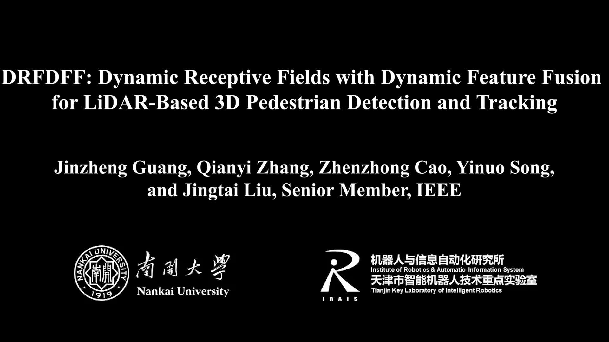
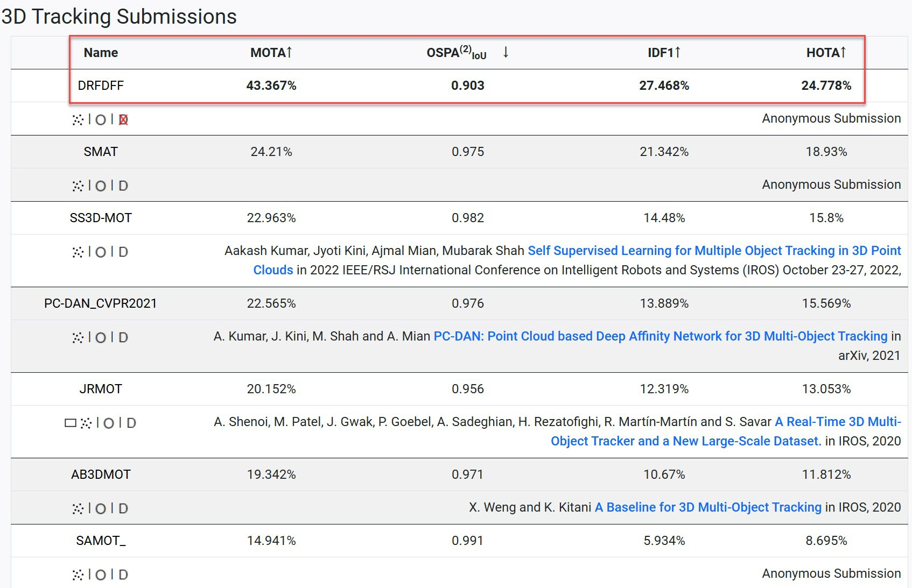
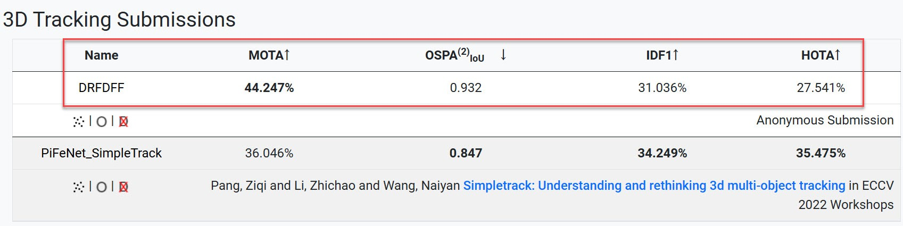
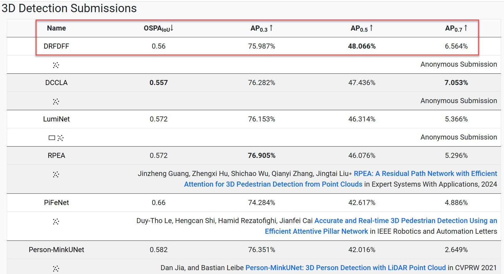
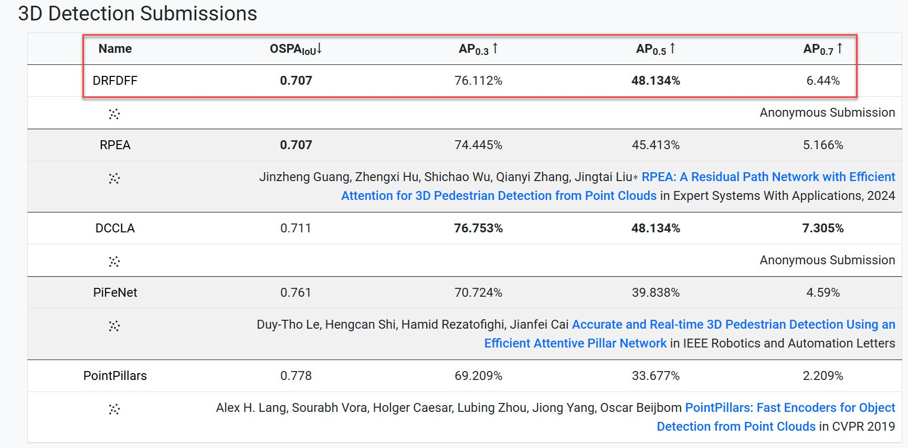

# DRFDFF

Official PyTorch implementation of DRFDFF: Dynamic Receptive Fields with Dynamic Feature Fusion for LiDAR-Based 3D Pedestrian Detection and Tracking.

### [https://www.youtube.com/watch?v=Kj0MAv6c1zA](https://www.youtube.com/watch?v=Kj0MAv6c1zA)


[](https://youtu.be/Kj0MAv6c1zA "")

## Experimental Results

### 3D Pedestrian Detection

Our DRFDFF ranks first on [JRDB 2022](https://jrdb.erc.monash.edu/leaderboards/detection22) and [JRDB 2019](https://jrdb.erc.monash.edu/leaderboards/detection) 3D pedestrian detection leaderboards.

|           Model           | AP (JRDB 2022) | AP (JRDB 2019) | 
|:-------------------------:|:--------------:|:--------------:|
| [RPEA](https://github.com/jinzhengguang/RPEA)   |    45.413%     |    46.076%     | 
|           DRFDFF (Ours)           |    48.134%     |    48.066%     | 
|        Improvement        |    +2.721%     |    +1.990%     | 
|       Our Checkpoint        |    [DRFDFF-JRDB2022.pth](https://github.com/jinzhengguang/DRFDFF/releases/download/v1.0/DRFDFF-JRDB2022.pth)     |    [DRFDFF-JRDB2019.pth](https://github.com/jinzhengguang/DRFDFF/releases/download/v1.0/DRFDFF-JRDB2019.pth)     | 


### 3D Pedestrian Tracking

Our DRFDFF ranks first on [JRDB 2022](https://jrdb.erc.monash.edu/leaderboards/tracking22) and [JRDB 2019](https://jrdb.erc.monash.edu/leaderboards/tracking) 3D pedestrian Tracking leaderboards.

|                      Model                      | MOTA (JRDB 2022) |                     Model                      | MOTA (JRDB 2019)  | 
|:-----------------------------------------------:|:--------------:|:----------------------------------------------:|:-----------------:|
| [PiFeNet SimpleTrack](https://github.com/ldtho/PiFeNet)  |    36.046%    | [SMAT](https://sites.google.com/view/smat-nav) |      24.210%      | 
|                     DRFDFF (Ours)                      |    44.247%     |               DRFDFF (Ours)                |      43.367%      | 
|                   Improvement                   |    +8.201%     |                      Improvement               |  +19.157%     | 
|       Our Result Files        |    [Tracking-JRDB2022.zip](https://github.com/jinzhengguang/DRFDFF/releases/download/v1.0/DRFDFF-Tracking-JRDB2022.zip)    |  Our Result Files        |   [Tracking-JRDB2019.zip](https://github.com/jinzhengguang/DRFDFF/releases/download/v1.0/DRFDFF-Tracking-JRDB2019.zip)     | 


## News

- **(2024-12-17)** 🔥 We release the code and model of our DRFDFF.

- **(2024-06-04)** 🏆 Our DRFDFF ranks first on [JRDB 2019 3D Pedestrian Tracking Leaderboard](https://jrdb.erc.monash.edu/leaderboards/tracking).



- **(2024-06-04)** 🏆 Our DRFDFF ranks first on [JRDB 2022 3D Pedestrian Tracking Leaderboard](https://jrdb.erc.monash.edu/leaderboards/tracking22).



- **(2024-05-28)** 🏆 Our DRFDFF ranks first on [JRDB 2019 3D Pedestrian Detection Leaderboard](https://jrdb.erc.monash.edu/leaderboards/detection).



- **(2024-05-28)** 🏆 Our DRFDFF ranks first on [JRDB 2022 3D Pedestrian Detection Leaderboard](https://jrdb.erc.monash.edu/leaderboards/detection22).




## Requirements

- `python==3.9`
- `PyTorch==1.13.1`
- `cuda==11.6`
- `torchsparse==1.2.0` [(link)](https://github.com/mit-han-lab/torchsparse)

```shell
python setup.py develop
cd lib/iou3d
python setup.py develop
cd ../jrdb_det3d_eval
python setup.py develop
```


## JRDB dataset

Download [JRDB dataset](https://jrdb.erc.monash.edu/) under `PROJECT/data`.


```shell
# convert_labels_to_KITTI
python lib/jrdb_devkit/detection_eval/convert_labels_to_KITTI.py
# train
python train.py --cfg jrdb19.yaml
# validation
python train.py --cfg jrdb19.yaml --ckpt DRFDFF-JRDB2019.pth --evaluation
```


## Acknowledgement

- RPEA [(link)](https://github.com/jinzhengguang/RPEA)
- Person_MinkUNet [(link)](https://github.com/VisualComputingInstitute/Person_MinkUNet)
- PiFeNet [(link)](https://github.com/ldtho/PiFeNet)
- torchsparse [(link)](https://github.com/mit-han-lab/torchsparse)
- PointRCNN [(link)](https://github.com/sshaoshuai/PointRCNN)

## Contact Information

If you have any suggestion or question, you can leave a message here or contact us directly: guangjinzheng@qq.com. Thanks for your attention!

